# **How to configure Inveo Daxi controller with Siemens PLC**

# **S7300/S71200/S71500**  

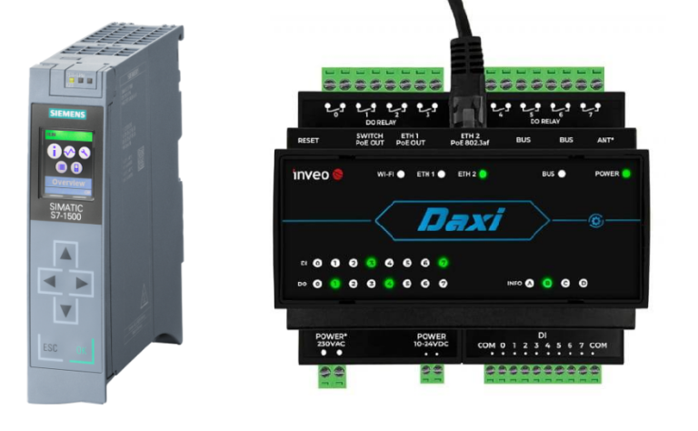

**"S7 PLC configuration"**

This tutorial is intended to demonstrate the process of configuring the Inveo Daxi controller with Siemens S7-300/S7-1200/S7-1500 controllers. 

We start by creating a new project and selecting a controller - it can be any controller from the S71200/S71500 family and selected S7300 models. In our case, it will be a 1511-1 unit.

Ensure that Daxi and Siemens are on the same network.

In our case it will be:

*   S7-1500 – IP: 192.168.0.10
    
*   Daxi – IP: 192.168.0.2
    

To configure the network settings in the S7-1200/S7-1500 controller, go to the **“Device Configuration”** tab. Pressing the right mouse button on the controller readme/image, select the **“Properties”** tab to open the settings. In the **“Ethernet Addresses”** tab, set the IP address and subnet mask.

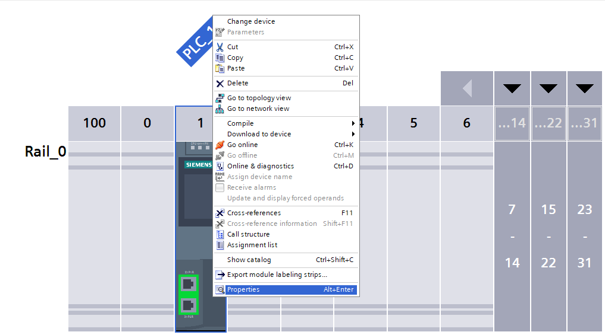

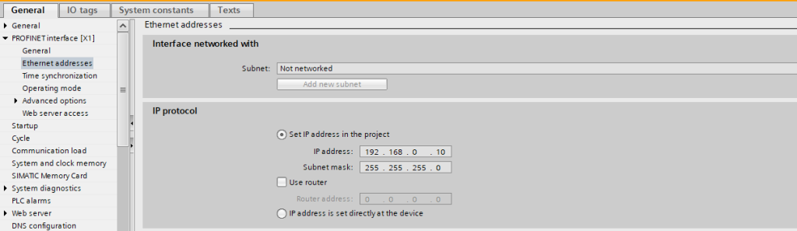

To allow the controller to communicate properly with Daxi, find the **“Protection and security”** tab, then set the parameters according to the following guidelines: enable **“Full Access”** and **“Put/Get”**. Setting these parameters will allow direct access to the controller's memory and exchange of data between devices.

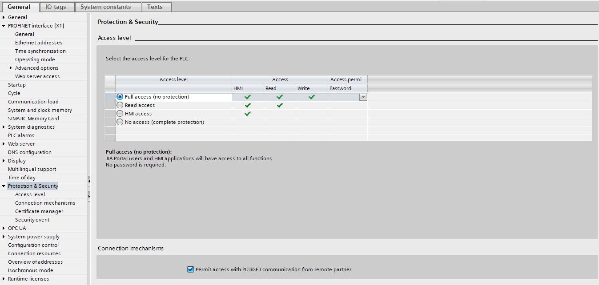

Daxi configuration

It is time to configure the Daxi controller. The operation of this controller is done entirely through the built-in web server. When you connect to Daxi for the first time, you should enter its default IP in the browser: 192.168.111.15. During this operation, make sure that our network card is in the same class as Daxi.

After connecting to the device we will be asked for a login and password, the default login credentials are:

**login - admin**

**password - admin**

It is recommended to change the login and password so that unauthorized people do not have access to change the configuration of the device.

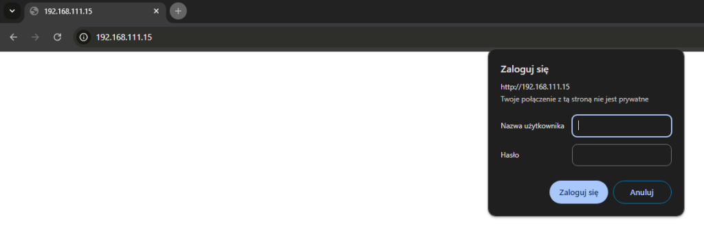

In the case of using our **“Discoverer”** application, our network card may be in another subnet - the router or switch must pass broadcast packets.

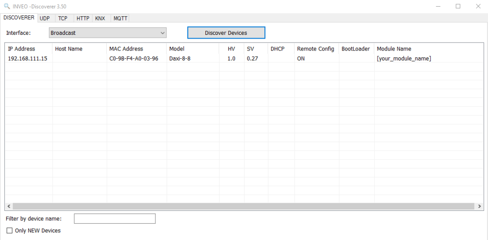

After correctly logging into the Daxi web server, we should see such a panel: 

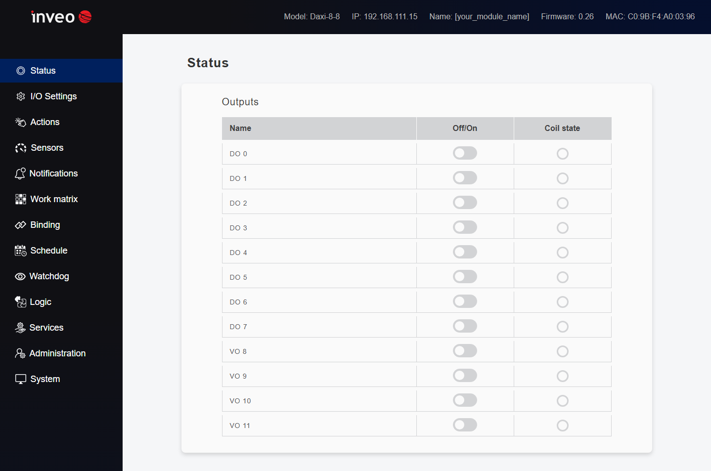

The next step is to set the appropriate IP address for the device so that it is in the same class as the PLC, as we remember at the beginning we determined that our application will be configured as follows:

*   S7-1500 - IP: 192.168.0.10
    
*   Daxi - IP: 192.168.0.2
    

In order to achieve such an effect, we need to go to the **“Administration”** tab , then to **“Network** ‘ and change the **’DHCP** ‘ parameter to **’Disable”** and set the IP address to the one required by our application - in this case it will be 192.168.0.2.

After pressing the **“Save”** button, the changes will be saved and Daxi will already restart with the newly assigned IP address. Further possible configuration of Daxi via the web server from now on will be possible only after changing the settings of the network card of the computer we are using to the appropriate IP address class.

We have reached the point where Daxi and Siemens are on the same network, but cannot yet exchange any data between them.

Therefore, we need to enable them to do so by going to the **“Services”** tab , then **“PLC”**. In the above tab, select the PLC family, in our case **"Siemens S7** ”, and assign numbers to each data block.

The last important parameter is the slot, it will vary depending on which controller we are working with. For S71200/S71500 controllers, the slot is 0 or 1, for S7300 - 2.

Also remember to set the IP address of our controller in the **“PLC Server Addr”** field .

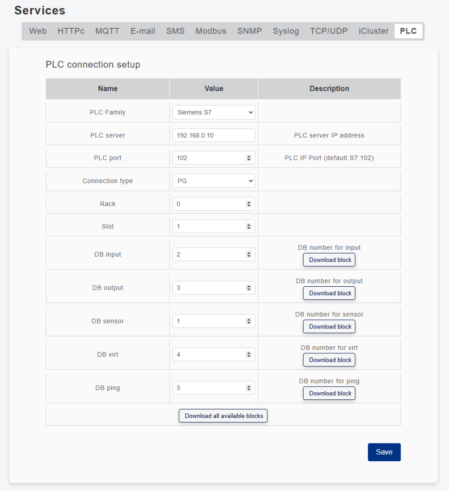

**“Data blocks"**

Each data block is responsible for a particular section. Below, the area for configuring data blocks has been marked in green. Here you will find blocks for handling inputs, outputs, sensors, user variables and watchdog(ping). Depending on our needs we can download the data block that is needed in our application - of course, there is also an option to download all data blocks: **“Download all available blocks”**, using this option one file will be generated that will generate 5 data blocks when imported into Tia Portal.

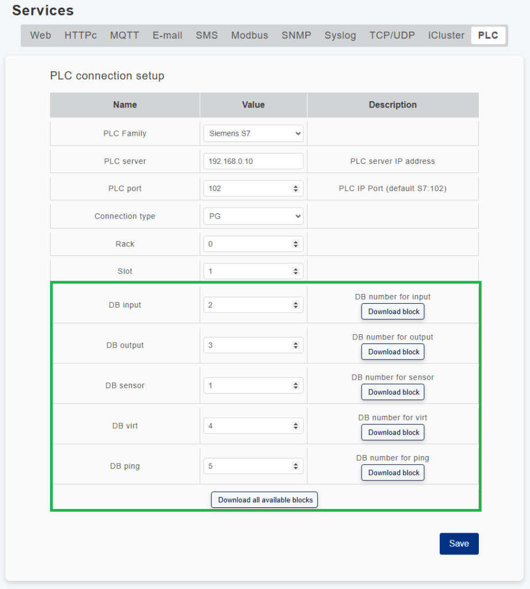

After pressing the button, a file with the extension **“.db”** will be downloaded to our computer:

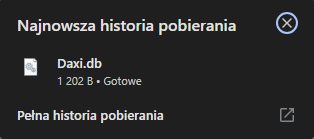

If you download a single block, the name will vary, for example, if you download only the data block for input handling, it will be called **“Daxi\_inputs.db”**.

Next, in the tree of our project, we are looking for the **“External source files”** tab, where we will need to include a data file that will be used for communication between the PLC and the Daxi controller.

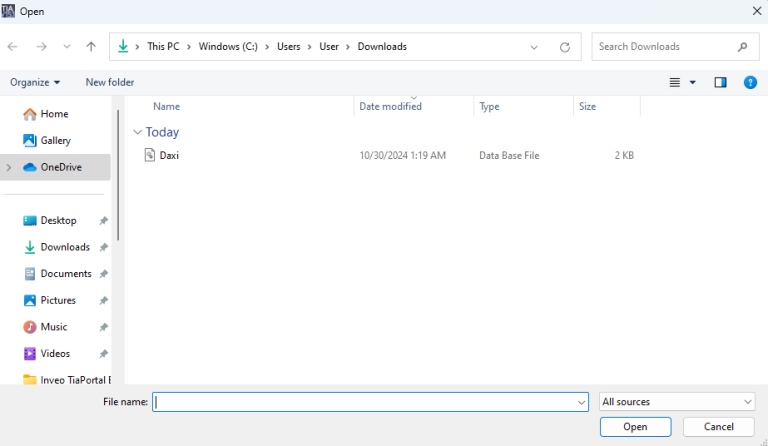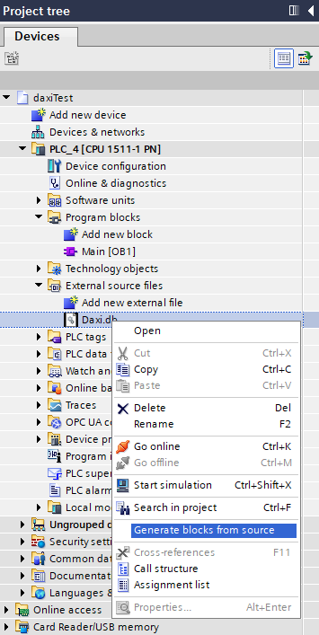

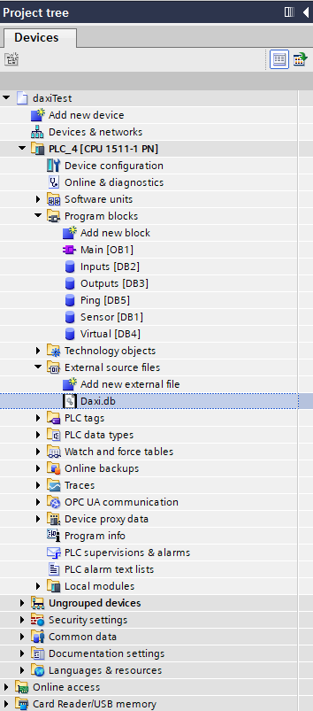

Then right-click on the file with the extension **“.db** “ and select the option **“generate blocks from source”**. After selecting the above option, five data blocks will be created automatically, and their numbers will be given incrementally depending on the presence of other data blocks in the project.

The data block numbers will be assigned automatically by Tia Portal - care should be taken that they match the values entered on the Daxi web server.

Having completed the above steps, the configuration of the devices is now complete. We can then move on to communication testing.

Communication test

To check whether the configuration has been successfully completed, enter any data block and check whether the value of the variable named **“liveBit”** changes its state. Cyclic switching of the state of the value of this variable from 0 to 1 symbolizes the correct establishment of communication between devices.

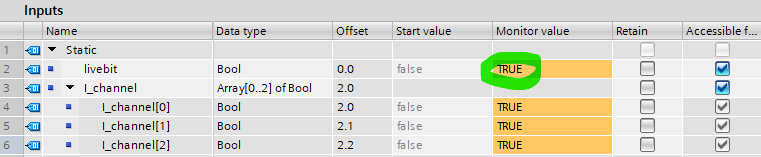

We can also do an IO-check, for this let's enter the **“Outputs”** block and try to drive some outputs:

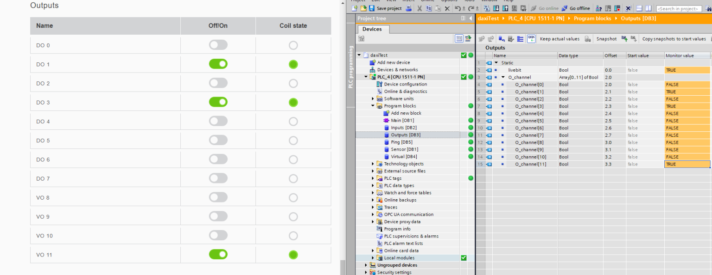

Then, in an analogous manner, let's check the inputs:

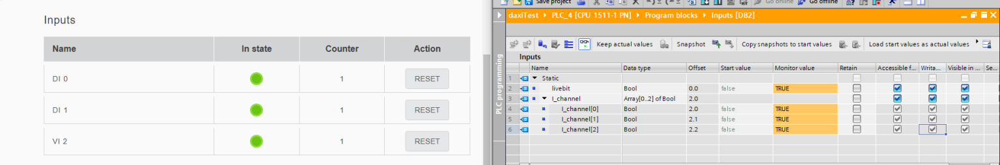

Handling other data blocks such as **“Ping,” “Sensors”** and **“Virtual”** requires additional operations from the Daxi web server - these functionalities will be demonstrated in future articles.

**“Ending"**

If the communication works properly it is time to create the first application with the Daxi controller - welcome to the next articles.